# US Hospital Financial Performance Analysis

**Which US hospitals are losing money, why, and where?** I used 13 years of the financial reports that every
Medicare hospital files with the federal government (about 4,300 hospitals a year, 2011 to 2023) to find out.

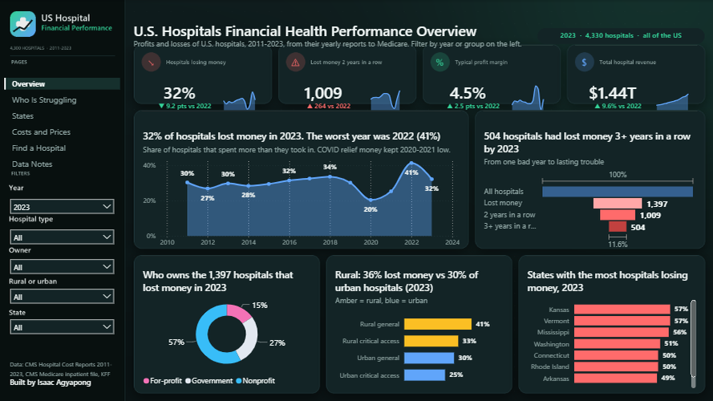

> ### In short
> - **One in three US hospitals spends more than it takes in.** In 2023, 32% of hospitals lost money. The worst year
>   was 2022, when 41% did.
> - **About 1,000 hospitals are in real trouble.** In 2023, 1,009 hospitals (about 1 in 4) lost money for the second
>   year in a row, the most since 2012. About 500 of them have lost money three years or more in a row.
> - **Rural hospitals have it hardest.** 36% of rural hospitals lost money in 2023, against 30% of city hospitals.
>   Rural hospitals run by a local government are the most likely to be stuck in losses.
> - **Costs are rising fast.** The cost of a hospital stay nearly doubled, from about $16,600 in 2011 to about
>   $32,200 in 2023. During COVID, spending on temporary agency nurses and staff went from 3% to 10% of wages.
> - **Medicaid expansion helps hospitals too.** In states that gave more low-income adults free health insurance
>   (Medicaid), the care hospitals give away for free fell by more than half. In the other states it barely moved.
>
> I built a database, checked it against official government figures, answered the questions with SQL, and made
> an interactive dashboard where anyone can filter by year, hospital type, owner, rural or city, and state, or look
> up a single hospital.
>
> **Next:** a companion machine learning project will use this data to predict which hospitals are likely to fall
> into financial trouble in the next two years.

The sections below go into technical detail.

---

## Key findings

"Profit margin" means the share of each dollar of income a hospital keeps after paying its costs. "Financial
stress" means losing money two years in a row. Every number comes from [SQL/query_results.md](SQL/query_results.md).

| Finding | Evidence |
|---|---|
| 2022 was the worst year in the data: 41% of hospitals lost money (32% in 2023) | Business Q1 |
| The typical hospital kept 4.5 cents per dollar in 2023; all hospitals together earned $1.44 trillion | Business Q1 |
| 1,009 hospitals (24%) lost money two years running in 2023, the most since 2012 | Business Q6 |
| 504 hospitals have lost money 3+ years in a row; 205 of them 5+ years | Business Q11 |
| Rural hospitals: 36% lost money vs 30% of urban hospitals (2023) | Business Q4 |
| Rural government general hospitals are the most stressed group: 38% lost money two years running | Business Q7 |
| For-profit general hospitals keep 8.5 cents per dollar, nonprofits 3.9, government 1.8 (2023) | Business Q3 |
| Cost per hospital stay rose 94%, from $16,606 (2011) to $32,165 (2023) | Business Q8 |
| Agency staff went from 2.9% of salaries (2019) to 10.4% (2022), then 7.1% (2023) | Business Q8 |
| Unpaid care fell from 6.7% to 3.0% of costs in Medicaid expansion states; 9.4% to 7.7% elsewhere | Business Q5 |
| Hospitals bill Medicare $4.87 for every $1 they are paid (up from $3.85 in 2013); Nevada $8.85 | Business Q9 |
| In Kansas and Vermont 57% of hospitals lost money in 2023, Mississippi 56% | Business Q10 |
| Hospitals with the most Medicaid patients lose money more often: 37% vs 29% for the fewest | Notebook section 10 |

## Recommendations

1. **Use two years of losses as an early warning.** A single bad year is common; two in a row is a sign of lasting
   trouble. State health departments and lenders can watch this list every year (the companion ML project turns it
   into a forecast).
2. **Target help at rural government hospitals.** They lose money most often, and they are often the only hospital
   nearby.
3. **Cut reliance on agency staff.** Agency spending tripled during COVID and was still more than double its 2019
   level in 2023. Hospitals that train and keep their own nurses protect their margins.
4. **Count hospital finances in Medicaid decisions.** Unpaid care is less than half as heavy in states that expanded
   Medicaid.
5. **Look past list prices.** What hospitals bill is almost five times what Medicare pays, so list prices say little
   about what care really costs.

## Data sources

All public, all real:

| Source | What I used |
|---|---|
| [CMS Hospital Provider Cost Report](https://data.cms.gov/provider-compliance/cost-report/hospital-provider-cost-report) | Yearly financial report of every Medicare hospital, 2011-2023 (80,077 reports) |
| [CMS Medicare Inpatient Hospitals by Provider](https://data.cms.gov/provider-summary-by-type-of-service/medicare-inpatient-hospitals/medicare-inpatient-hospitals-by-provider) | What hospitals billed Medicare vs what they were paid, 2013-2023 |
| [KFF Medicaid expansion tracker](https://www.kff.org/affordable-care-act/issue-brief/status-of-state-medicaid-expansion-decisions/) | Which states expanded Medicaid, and when |
| [MedPAC Data Book](https://www.medpac.gov/) | Published hospital margins, used to check my numbers |

`Python/01_download_data.py` finds each file in the CMS data catalog by title and year and records its URL, size and
checksum in [Data/raw/manifest.json](Data/raw/manifest.json).

## How it works

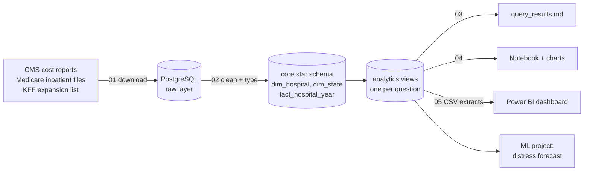

Study group: general acute care hospitals and critical access hospitals (small rural hospitals with 25 beds or
fewer) in the 50 states and DC. 5,185 hospitals, 57,774 hospital-years after cleaning.

## Can the numbers be trusted?

MedPAC (the commission that advises Congress on Medicare) publishes the all-payer profit margin of general hospitals
from the same reports. Using its rules (a report counts in the federal fiscal year that holds its midpoint; Maryland
left out), my figures match:

| Year | This project | MedPAC |
|---|---|---|
| 2019 | 7.8% | 7.8% |
| 2020 | 6.7% | 6.6% |
| 2021 | 10.9% | 10.6% |
| 2022 | 3.0% | 2.3% |
| 2023 | 7.5% | 6.4% |

The gap of up to one point in 2022-2023 most likely comes from MedPAC's own outlier rules, which are not published
in detail. Other checks in [SQL/03_data_quality.sql](SQL/03_data_quality.sql): no duplicate hospital-years after
cleaning, income minus expenses equals net income on all 78,928 reports, and 99.9%+ of Medicare inpatient hospitals
match a cost report.

## Data problems I found and fixed

| Problem | What I did |
|---|---|
| **"Rural" in the cost report is a payment label, not a location.** City hospitals can ask Medicare to pay them as rural; the number doing so rose from 250 (2016) to 732 (2023). Cleveland Clinic's main hospital was labelled rural. | Defined rural by location: CMS codes rural areas as CBSA 999xx. Rural hospitals by location stay steady at about 1,800-1,900 a year. |
| **"Days of cash" is misleading.** Hospitals in a health system hold little cash of their own because the parent company keeps it: the typical for-profit hospital reports 0 days. | Defined financial stress by losses (two years in a row), not cash. |
| **Two reports for the same hospital and year** (1,226 cases), usually a short report after an owner change. | Kept the longest report. |
| **Reports covering part of a year** (1,701 kept reports under 300 days). | Left them out so every year is a full year. |
| **Impossible margins** (over 100% or no revenue): 2.6% of general hospital-years. | Kept in the database, left out of averages. |
| **US territories** (849 reports). | Left out; the study covers the 50 states and DC. |
| **The cost report's year** is the year a report starts, not the year it covers most. | Stored both; used MedPAC's midpoint rule for the check above. |

## Skills shown

**SQL (PostgreSQL 18):** raw → core → analytics layers; CTEs; window functions (`ROW_NUMBER` to pick one report per
hospital-year, `LAG` for year-over-year change and two-year losses, gaps-and-islands for loss streaks, `RANK`,
`NTILE`); `percentile_cont` medians; `FILTER`; `corr` and `regr_slope`; `DISTINCT ON`; a materialized view with a
unique index for the ML project; a tablespace on a separate drive and unlogged staging tables.

**Python:** catalog-driven downloads with checksums; bulk loading with psycopg 3 `COPY`; a notebook built with
nbformat and executed so outputs show on GitHub; matplotlib charts with a shared style.

**Power BI:** the whole report is generated from Python as a PBIP (TMDL model + PBIR JSON) and validated against
Microsoft's schemas. DAX measures with a disconnected year table, year-over-year arrows, titles written by DAX that
state the finding for the current filters, rankings that ignore map clicks (`REMOVEFILTERS`), a matrix tile map of
the states, a funnel, synced filters across pages, a hospital lookup page with a gauge, and a hover tooltip page.
The page artwork (sidebar, rounded tiles, icons) is drawn with Pillow from the same layout the visuals use.

## Charts

| | |
|---|---|
| 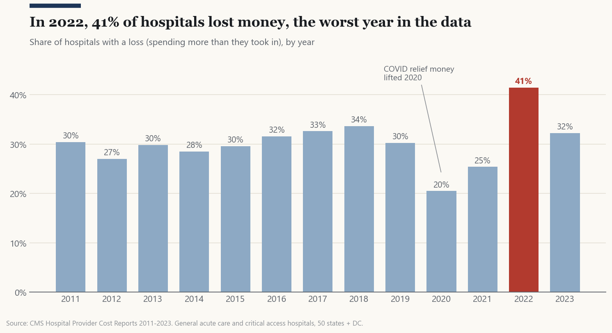 | 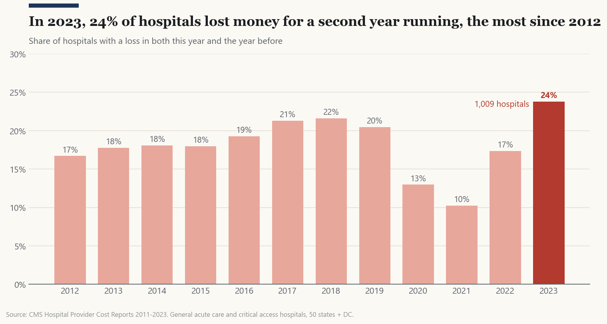 |
| 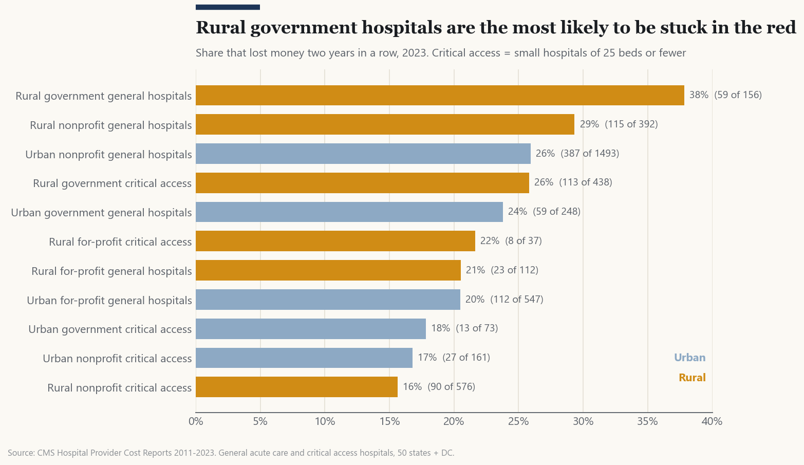 | 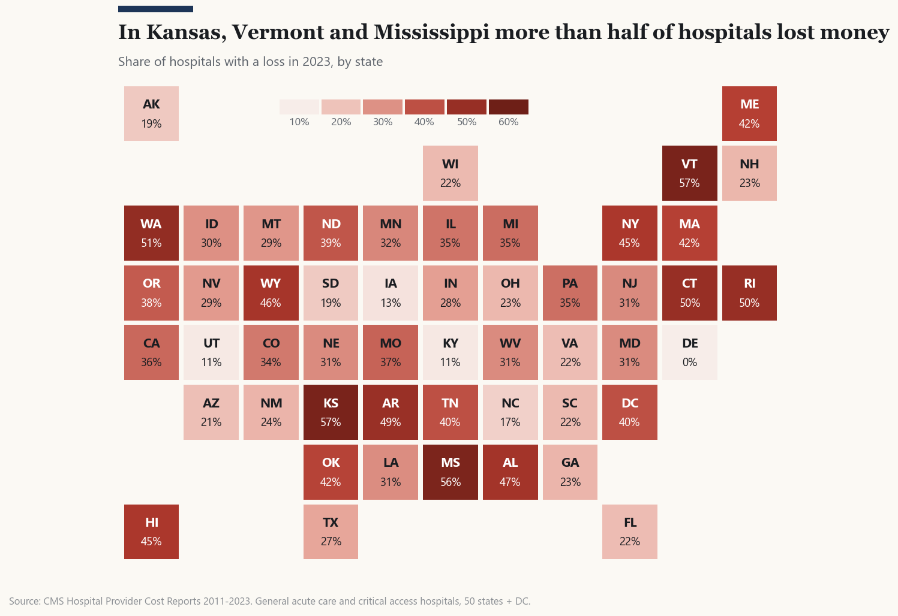 |
| 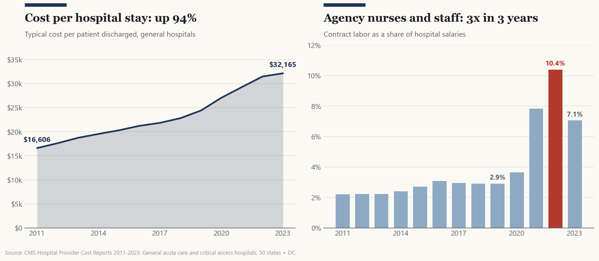 | 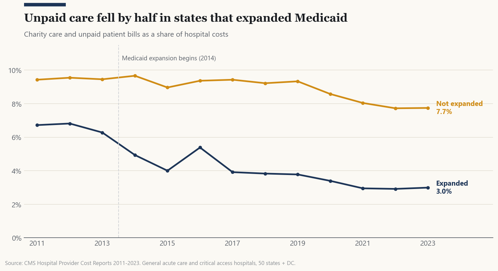 |
| 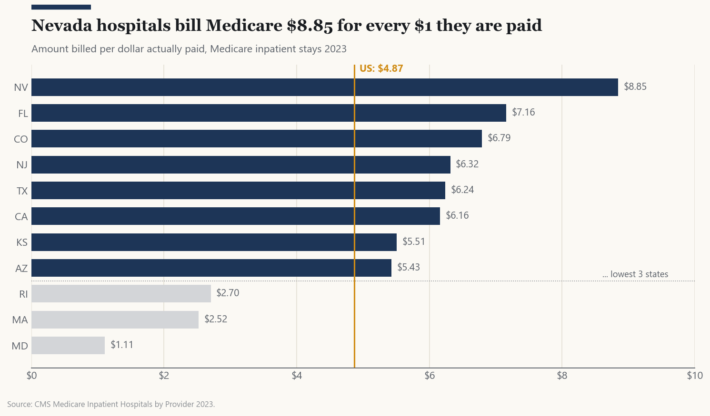 | 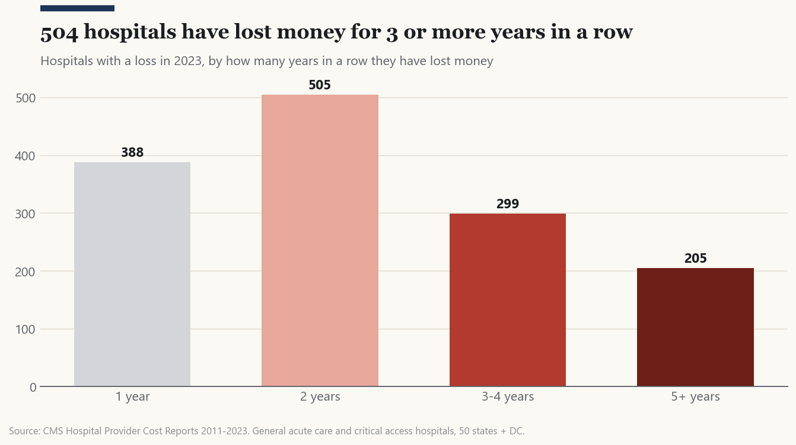 |

## Dashboard

Six pages: **Overview**, **Who Is Struggling**, **States**, **Costs and Prices**, **Find a Hospital** and
**Data Notes**. The filters on the left (year, hospital type, owner, rural or urban, state) apply to every page.

| | |
|---|---|
| 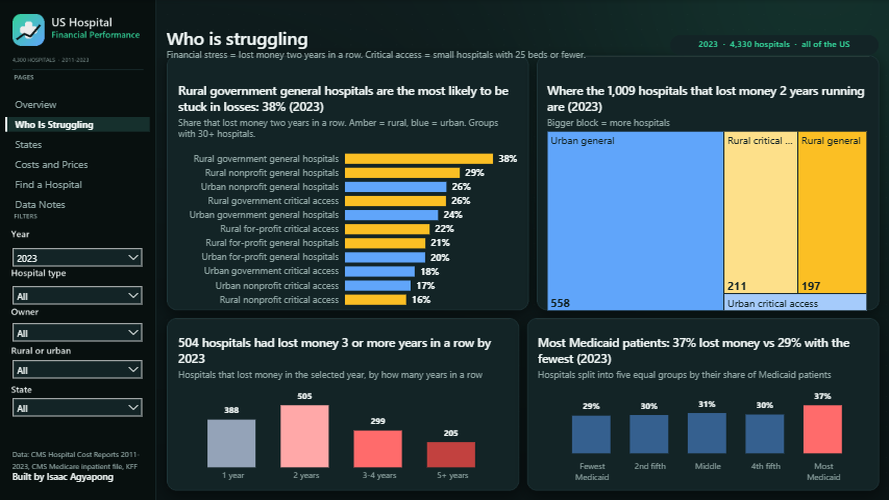 | 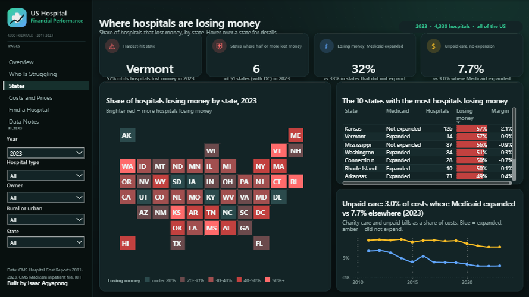 |
| 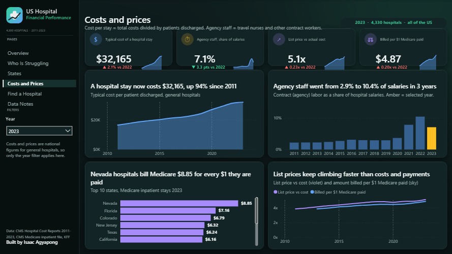 | 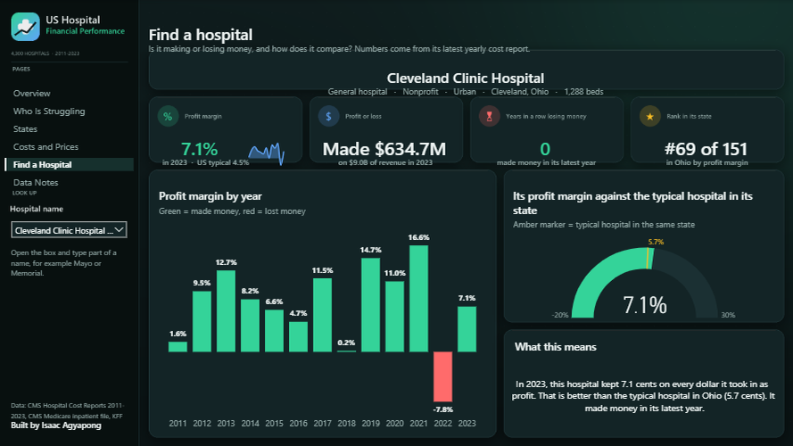 |

## Project structure

```
Data/raw/            manifest.json (source URLs, sizes, checksums); large files are not in Git
Python/              01 download, 02 load PostgreSQL, 03 run SQL, 04 notebook, 05 Power BI extracts,
                     06 Power BI project, make_background.py (dashboard artwork), viz_style.py (chart style)
SQL/                 00 database, 01 schemas, 02 transform, 03 data quality, 04 analytics views,
                     05 business questions, query_results.md (every query with its output)
dashboard/           Hospital_Finance.pbip (open in Power BI Desktop), data/ (CSV extracts), assets/
Image/               charts and dashboard screenshots
run_all.py           rebuilds everything in order
```

## How to reproduce

1. Install Python 3.13, PostgreSQL 18 and Power BI Desktop.
2. `pip install -r requirements.txt`
3. Set the PostgreSQL login in `%APPDATA%\postgresql\pgpass.conf` (or `PG*` environment variables).
4. `python run_all.py` downloads the data (about 70 MB), builds the database, runs every query, runs the notebook
   and generates the dashboard.

To only look at the dashboard: open `dashboard/Hospital_Finance.pbip` in Power BI Desktop. It reads the CSV files
in `dashboard/data/`, so no database is needed. If you cloned the repository to a different folder, go to
Transform data > Edit parameters and set `DataFolder` to your `dashboard\data\` folder, then Refresh.

## Limitations

- Cost reports are filled in by hospitals and only lightly audited; a few have obvious errors (left out, see above).
- A hospital's fiscal year may not match the calendar year.
- Profit includes investment income and donations, which lifted margins in good stock market years, and COVID
  relief money, which lifted 2020 and 2021.
- The comparison of Medicaid expansion states with other states shows a difference, not proof that expansion caused
  it (my [Medicaid expansion project](https://github.com/Isaac-Agyapong/Medicaid_Expansion_Impact_Model) measures a
  causal effect on insurance coverage).
- Maryland sets hospital prices by law, so its billed vs paid numbers are not comparable with other states.

---

Built by **Isaac Agyapong** · M.S. Data Science, Florida Polytechnic University ·
[GitHub](https://github.com/Isaac-Agyapong)
